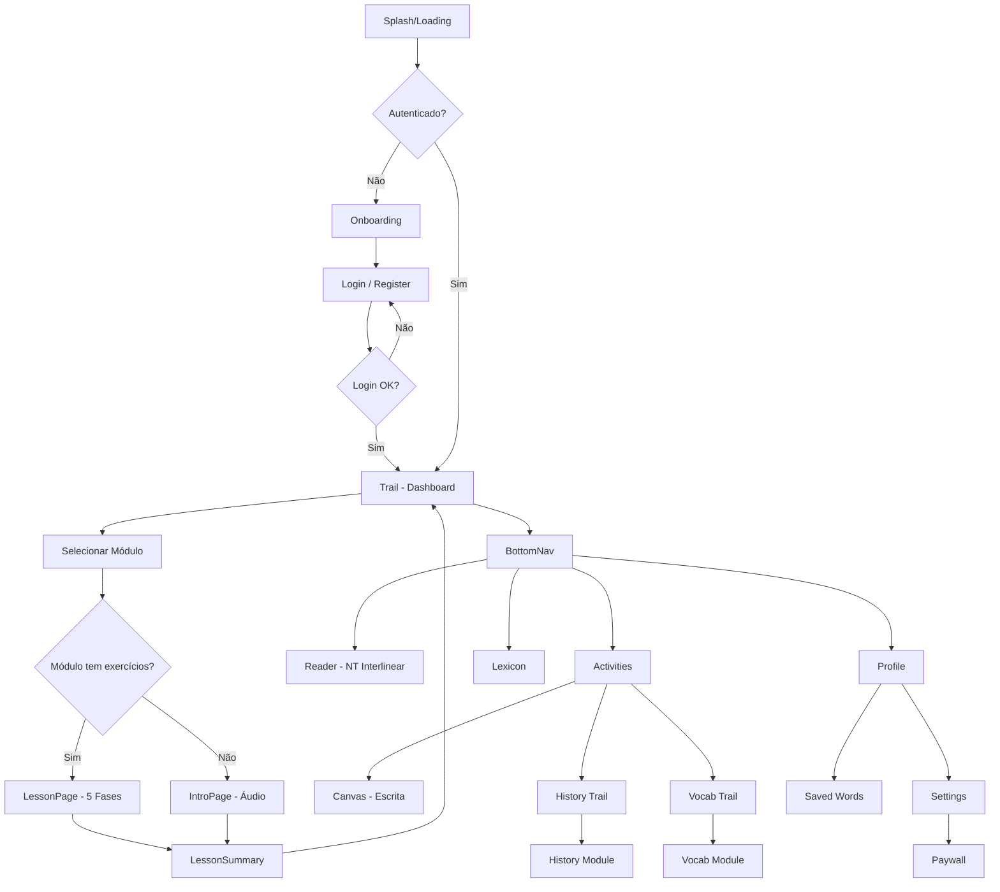
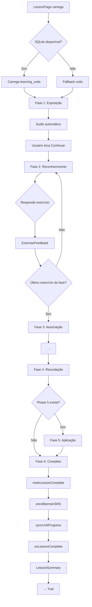
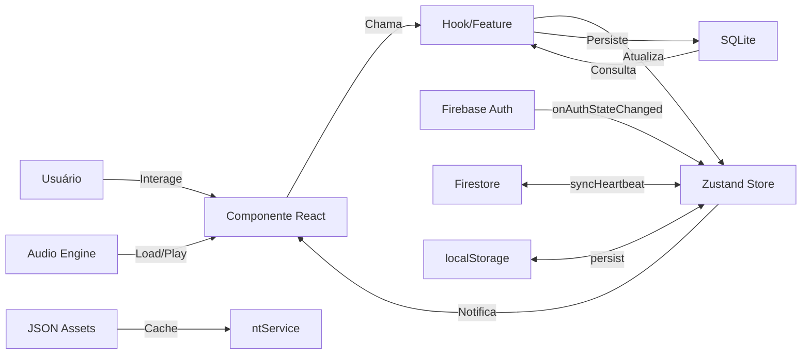
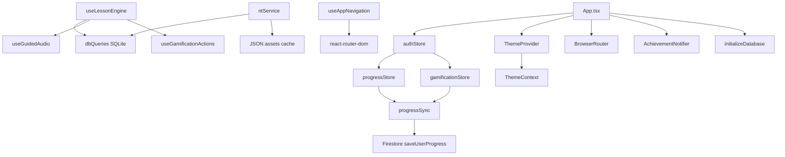

# Manual Mestre — Koiné: Grego do Novo Testamento

**Application DNA — Impressão Digital do Sistema**

> Gerado em: 11/06/2026
> Versão: 1.0.0
> App ID: `com.berith.koineapp`

---

## 1. VISÃO GERAL DO SISTEMA

### 1.1 Objetivo da Aplicação

Aplicativo mobile-first para **aprendizado do Grego Koiné (grego bíblico do Novo Testamento)**. Combina metodologia de aquisição de segunda língua (Comprehensible Input, TBLT, CLT) com gamificação, leitura interlinear do Novo Testamento grego, prática de escrita das letras gregas e conteúdo histórico-cultural.

### 1.2 Problema que Resolve

- Inexistência de apps focados exclusivamente em **Grego Koiné** com metodologia linguística moderna
- Barreira de entrada para estudos teológicos que exigem conhecimento do grego
- Falta de ferramentas que integrem **alfabeto, vocabulário, gramática, leitura do NT e história** num fluxo único
- Dificuldade de manter consistência nos estudos sem gamificação e lembretes

### 1.3 Público-alvo

- Estudantes de teologia e seminário
- Pastores e líderes religiosos
- Entusiastas de línguas bíblicas
- Cristãos que desejam ler o NT no idioma original
- Falantes nativos de **português brasileiro** (todo o conteúdo e UI em português)

### 1.4 Principais Funcionalidades

1. **Trilha Principal de Aprendizado** (Ciclos I a VIII) — Lições estruturadas com 5 fases pedagógicas
2. **Leitor Interlinear do Novo Testamento** — 27 livros, grego + análise morfológica + glossário por palavra
3. **Prática de Escrita (Canvas)** — Desenho de letras gregas com validação por template
4. **Sistema de Revisão (SRS)** — Repetição espaçada com cartões de vocabulário
5. **Gamificação** — XP, níveis, streaks, conquistas, troféus, ligas
6. **Palavra do Dia** — Vocabulário com notificações e salvamento
7. **Trilha de História do NT** — Contexto histórico-cultural em 4 blocos
8. **Trilha de Vocabulário do NT** — 100 palavras mais frequentes em 11 módulos
9. **Dicionário Strong** — Léxico grego-português com Strong ID
10. **Áudio Guiado** — Narração sincronizada com texto nas lições

### 1.5 Fluxo Macro do Usuário

```
Onboarding (3 slides + meta diária)
  → Login/Cadastro (email ou Google)
    → Dashboard / Trilha Principal
      → Seleciona módulo na trilha
        → IntroPage (se módulo introdutório com áudio)
        → OU LessonPage (se módulo com exercícios)
          → Fase 1: Exposição (áudio + card informativo)
          → Fase 2: Reconhecimento (exercícios)
          → Fase 3: Associação (exercícios)
          → Fase 4: Recordação (exercícios)
          → Fase 5: Aplicação (exercícios opcionais)
          → Resumo com score, XP, SRS enrollment
      → Retorna à trilha
        → Pode acessar: Leitor NT, Lexicon, Atividades, Perfil, Configurações
          → Leitor NT: navega entre livros/capítulos com interlinear
          → Canvas: prática de escrita das letras
          → História: módulos textuais com XP
          → Vocabulário: listas temáticas de palavras
```

---

## 2. ARQUITETURA GERAL

### 2.1 Stack Tecnológica

| Camada | Tecnologia | Versão |
|--------|-----------|--------|
| **Frontend** | React 18 + TypeScript | ^18.3.1 |
| **Build** | Vite 5 | ^5.1.0 |
| **Mobile** | Capacitor 6 (Android + iOS) | ^6.2.1 |
| **UI Framework** | Ionic React 7 + HeroUI 2 | ^7.8.6 / ^2.8.10 |
| **Estilos** | Tailwind CSS 4 | ^4.0.0 |
| **Animações** | Framer Motion 12 | ^12.40.0 |
| **Ícones** | Ionicons 7 + Lucide React | ^7.4.0 / ^1.17.0 |
| **Autenticação** | Firebase Auth + Capacitor Firebase Auth | ^10.14.1 |
| **Banco de Dados** | SQLite (local) + Firebase Firestore (nuvem) | — |
| **Armazenamento** | SQLite + localStorage | — |
| **Push** | Firebase Cloud Messaging | — |
| **Pagamento** | RevenueCat (Capacitor) | ^13.0.0 |
| **Revisão** | SRS próprio (SM-2 simplificado) | — |
| **Áudio** | HTML5 Audio + Cues JSON | — |

### 2.2 Comunicação entre Camadas

```
React Components (UI)
  → Custom Hooks (useLessonEngine, useAuth, useGuidedAudio, useGamificationActions)
    → Zustand Stores (authStore, progressStore, gamificationStore, settingsStore)
      → Database Layer (SQLite local via dbQueries)
      → Firebase Services (Firestore sync, Auth)
      → Static Content (curriculum JSON, nt_text.json, nt_pt.json)
```

**Fluxo de dados típico:**
1. Usuário interage com componente na página
2. Componente chama hook/action customizado
3. Hook atualiza store Zustand (síncrono) e/ou banco SQLite (assíncrono)
4. Store notifica componentes via React state
5. SyncService envia dados para Firestore a cada 5 min (heartbeat)

### 2.3 Estrutura de Diretórios

```
src/
├── App.tsx                      # Roteamento principal + providers
├── main.tsx                     # Entry point
├── index.css                    # Tailwind imports
├── core/
│   ├── constants/               # Routes, config, achievements, trophies, XP
│   ├── types/                   # TypeScript interfaces (user, lesson, greek, history)
│   └── utils/                   # validators, xpCalculator, greek, markdown, canvasTemplate
├── features/
│   ├── auth/                    # firebase.ts, auth.ts, authStore.ts, useAuth.ts, firestore.ts
│   ├── database/                # sqlite.ts, schema.ts, queries.ts, init.ts, seeds/
│   ├── progress/                # progressStore.ts, useProgressSync.ts
│   ├── gamification/            # gamificationStore.ts, useGamificationActions.ts
│   ├── lesson-engine/           # useLessonEngine.ts
│   ├── reader/                  # ntService.ts
│   ├── audio/                   # AudioEngine.ts, types.ts, useGuidedAudio.ts
│   ├── strong/                  # useStrong.ts
│   ├── navigation/              # useNavigation.ts
│   ├── settings/                # settingsStore.ts
│   └── theme/                   # ThemeContext.tsx
├── ui/
│   ├── components/              # Button, Card, Input, BottomSheet, ProgressBar, etc.
│   ├── exercises/               # ExerciseShell, Flashcard, MultipleChoice, FillBlank, etc.
│   ├── greek/                   # GreekText, WordPopup
│   ├── layouts/                 # SafeArea, BottomNav
│   └── pages/                   # auth/, trail/, lesson/, reader/, canvas/, profile/, history/, vocab/, lexicon/, activities/, intro/, onboarding/
├── content/                     # Static content: curriculum, alphabet, history, vocabulary, strong, word-of-day
├── tools/                       # apostilaParser, apostilaCodegen, validateCues
├── scripts/                     # downloadNT, downloadBLivre, buildBooks, buildGlossary, buildInterlinear
└── assets/                      # Images, fonts
```

---

## 3. ESTRUTURA COMPLETA DE PÁGINAS

### 3.1 OnboardingPage

**Objetivo:** Apresentar o app ao novo usuário e configurar meta diária.

**Rota:** `/onboarding`

**Acesso:** Usuário não autenticado (PublicRoute). Redireciona para Trail se já autenticado.

**Componentes visuais:**
- 3 slides com ícone + título + descrição
- Indicador de slide (bolinhas)
- Botão "Pular" (topo direito)
- Botão "Próximo" (rodapé)
- Tela de seleção de meta: 3 cards (Casual 5min, Regular 10min, Intensivo 15min)
- Botão "Começar a Aprender"

**Dados exibidos:**
- Conteúdo estático definido em `SLIDES` array no próprio componente

**Eventos:**
- Próximo → avança slide ou vai para meta diária ou navega para `/auth/login`
- Pular → `/auth/login`
- Selecionar meta → salva `daily_goal` no SQLite (`user_settings`)

**Consequências:**
- Meta diária persistida no SQLite
- Navegação para tela de login

### 3.2 LoginPage

**Objetivo:** Autenticar usuário (email/senha ou Google).

**Rota:** `/auth/login`

**Acesso:** Usuário não autenticado.

**Componentes visuais:**
- Logo "Κοινή" em grego
- TypewriterText com frases motivacionais animadas
- Botão "Entrar com Google" (ênfase máxima)
- Divider "ou"
- Input e-mail + Input senha
- Mensagem de erro (motion)
- Botão "Entrar"
- Link "Criar Conta Gratuita"
- Footer: "7 dias grátis do Premium • Sem cartão de crédito"

**Dados exibidos:** Formulário vazio.

**Eventos:**
- Entrar com Google → `signInWithGoogle()` → navega para `/trail`
- Entrar (email) → valida campos → `signInWithEmail()` → `/trail`
- Criar Conta → navega para `/auth/register`

**Consequências:**
- Auth store populada com user + progress
- Progresso sincronizado do Firestore (ou criado se novo)
- Redirecionamento para Trail

### 3.3 RegisterPage

**Objetivo:** Criar nova conta.

**Rota:** `/auth/register`

**Acesso:** Usuário não autenticado.

**Componentes visuais:**
- Logo "Κοινή"
- Input Nome + Input e-mail + Input senha
- Botão "Criar Conta"
- Link "Já tem uma conta? Entrar"
- Validação de senha: 8+ chars, 1 maiúscula, 1 número

**Eventos:**
- Criar Conta → `signUpWithEmail()` → envia email de verificação → `/trail`
- Entrar → `/auth/login`

**Consequências:**
- Conta Firebase criada
- Documento `users/{uid}` criado no Firestore com progresso inicial
- Redirecionamento para Trail

### 3.4 TrailPage (Dashboard Principal)

**Objetivo:** Página central do app. Mostra progresso, acesso aos módulos, streak, SRS.

**Rota:** `/trail`

**Acesso:** Usuário autenticado (PrivateRoute).

**Componentes visuais:**
- Avatar do usuário + saudação + nome
- StreakBadge (🔥 + dias)
- Banner "Continuar Leitura" (se houver posição salva no Reader)
- PalavraDoDiaCard (se disponível)
- WeeklyCalendar (calendário semanal de streak)
- Progresso Geral (barra + contagem módulos)
- Card Revisão SRS inline (com botão "Revisar" se pendente)
- **Ciclo I:** Banner + grid de UnitGroups com UnitNodes
- **Ciclo II:** Banner + grid de UnitGroups
- **Ciclo III:** Card bloqueado 🔒
- UnitDetailSheet (modal inferior ao clicar num módulo)
- PalavraDoDiaSheet
- BottomNav (5 abas)

**Dados exibidos:**
- SQLite: `modules` (ciclo 1 e 2), `srs_cards` (contagem pendente)
- Content: `cycles.ts`, `modules.ts`, `unit-groups.ts`
- Stores: `progressStore.completedLessons`, `gamificationStore.streakDays`, `authStore.user`
- localStorage: `koine.reader.lastPosition`
- `useWordOfTheDay()` hook

**Eventos:**
- Clicar módulo → UnitDetailSheet com nome + descrição + botão "Começar"
- "Começar" (módulo com exercícios) → `/lesson/:moduleId`
- "Começar" (módulo introdutório, total_exercises = 0) → `/intro/:moduleId`
- "Revisar" → `/review` (ActivitiesPage)
- "Ir" (continuar leitura) → `/reader/:book/:chapter/:verse`
- Palavra do Dia → abre sheet com detalhes
- BottomNav → navega entre abas

**Regras de desbloqueio de módulos:**
- C1-M00 (introdução) e C1-M01: sempre disponíveis
- Demais C1: módulo anterior completado
- C2-M01: C1-M10 completado
- Demais C2: módulo C2 anterior completado
- Módulo bloqueado não pode ser clicado

### 3.5 LessonPage

**Objetivo:** Executar uma lição completa com 5 fases pedagógicas.

**Rota:** `/lesson/:lessonId`

**Acesso:** Usuário autenticado.

**Componentes visuais:**
- **Fase 1 (Exposição):** ExposureCard com informações da unidade, áudio tocando automaticamente
- **Fases 2-5 (Exercícios):** ExerciseShell com header (fase, progresso, step counter)
  - ExerciseFeedback (modal após cada resposta)
- **Fase 6 (Completo):** LessonSummary com score, mastery level, XP earned
- LoadingScreen durante preparação
- EmptyState se falha no carregamento

**Tipos de exercício (renderizados condicionalmente):**
| Tipo | Componente | Descrição |
|------|-----------|-----------|
| `flashcard` | FlashcardExercise | Mostra grego → usuário avalia se sabe |
| `flashcard_confirm` | FlashcardExercise | Similar com confirmação |
| `multiple_choice` | MultipleChoiceExercise | Escolher entre opções |
| `fill_blank` | FillBlankExercise | Digitar resposta |
| `word_order` | WordOrderExercise | Ordenar palavras |
| `matching_pairs` | MatchingPairsExercise | Parear cartões |
| `tpr_digital` | TPRExercise | Resposta física (toque) |
| `canvas` | CanvasExercise | Desenhar letra |
| `narration` | NarrationExercise | Compreensão auditiva |

**Dados carregados:**
- SQLite: `learning_units` do módulo via `dbQueries.getLearningUnitsByModule()`
- Fallback: unidades geradas se SQLite falhar

**Eventos:**
- Avançar exposição (fase 1 → 2)
- Responder exercício → feedback + XP
- Continuar após feedback → próximo exercício/fase
- Ao completar (fase 6):
  1. `markLessonComplete()` na progressStore
  2. `enrollItemsInSRS()` no SQLite
  3. `syncUnitProgress()` no SQLite (unit_progress)
  4. `onLessonComplete()` (gamificação: XP, streak, achievements)
  5. `syncToFirestore()` (heartbeat write)
  6. Navegação para trilha via botão

### 3.6 IntroPage (Módulo Introdutório)

**Objetivo:** Apresentar módulo com áudio guiado (narração + texto sincronizado).

**Rota:** `/intro/:moduleId`

**Acesso:** Usuário autenticado, para módulos com `total_exercises === 0`.

**Componentes visuais:**
- Botão voltar + título do módulo
- Área central: texto do cue atual ou placeholder
- Versículo-troféu (anchor verse) com GreekText
- Player: voltar 10s, play/pause, avançar (próximo cue ou +10s)
- Barra de progresso do áudio
- Botão "Concluir Introdução"

**Dados carregados:**
- `/audio/{moduleId}/{moduleId}.cues.json` (cues)
- `/audio/{moduleId}/{moduleId}.mp3` (áudio)
- `MODULES` content para metadados

**Eventos:**
- Play/Pause → controla áudio
- Avançar/Voltar → navega entre cues ou pula 10s
- Concluir → `markLessonComplete()` → `onLessonComplete()` → volta para Trail

### 3.7 CanvasPage (Prática de Escrita)

**Objetivo:** Treinar escrita das 24 letras gregas em canvas touch.

**Rota:** `/canvas/:letterId`

**Acesso:** Usuário autenticado.

**Componentes visuais:**
- Header com nome da letra + som
- Navegação entre letras (prev/next)
- Display da letra (maiúscula + minúscula) em GreekText
- Canvas HTML5 para desenho
- Botões: Apagar, Verificar
- Feedback visual (borda verde/vermelha)
- Score numérico
- Indicador de progresso (bolinhas)
- Placar "Alfabeto Completo!" ao terminar todas

**Dados carregados:**
- SQLite: `letters` via `dbQueries.getAllLetters()`
- localStorage: `koine-canvas-completed` (quais letras já foram completadas)

**Eventos:**
- Touch/mouse draw → desenha no canvas e registra pontos
- Verificar → `calculateScore()` compara pontos do aluno com template da letra
- Score ≥ 70 (CANVAS_PASS_SCORE) → aprovado:
  - Marca letra como completa
  - Concede XP (5 na primeira tentativa, 2 nas seguintes)
  - Se todas 24 completas → marca unidade C1 completa
  - Haptic feedback leve
- Score < 70 → falha, incrementa attempts
- 3 tentativas → botão "Pular letra"

### 3.8 ReaderPage (Leitor Interlinear do NT)

**Objetivo:** Ler o Novo Testamento grego com interlinear (grego + glossário + análise morfológica).

**Rota:** `/reader` ou `/reader/:book/:chapter/:verse`

**Acesso:** Usuário autenticado.

**Componentes visuais:**
- Sticky header com:
  - Seletor de modo de leitura (3 modos)
  - Seletor de capítulo (PassageSelectorSheet)
  - Nome do livro + capítulo
- Modos de leitura:
  - **Interlinear:** grego + gloss + análise morfológica (lemma, parsing)
  - **Assistido:** grego com gloss, tradução fluente ocultável
  - **Imersão:** apenas grego (sem ajuda)
- VerseTranslationCard (tradução PT expandível)
- Chip de filtro Strong (destaca ocorrências de um Strong ID)
- Navegação entre capítulos (botões Anterior/Próximo)
- PassageSelectorSheet (grade livros × capítulos)
- BottomNav

**Dados carregados:**
- SQLite: `nt_interlinear`, `nt_pt`, `nt_text`
- Fallback: JSON estáticos (`/assets/nt_interlinear.json`, `/assets/nt_pt.json`)
- Cache em memória (singleton no ntService)

**Eventos:**
- Selecionar livro/capítulo → carrega dados interlineares
- Tocar versículo → highlight por 2s
- Tocar palavra → se tiver Strong ID, filtra por ele
- Alternar modo → esconde/mostra gloss, lemma, parsing
- Expandir tradução PT → toggle visibilidade
- Navegar capítulo → salva posição no localStorage

### 3.9 ActivitiesPage

**Objetivo:** Acesso rápido a atividades extracurriculares (história, escrita, vocabulário).

**Rota:** `/review`

**Acesso:** Usuário autenticado.

**Componentes visuais:**
- Header "Atividades"
- Card "Trilha Paralela: História do NT" → navega para `/history`
- Seção "Prática de Escrita" → grid 6×4 de letras gregas, algumas bloqueadas
- Card "Trilha Paralela: Vocabulário do NT" → navega para `/vocab`
- Card "Leitura Guiada" (bloqueado, futuro)
- BottomNav

**Regras de desbloqueio (escrita):**
- Letras desbloqueadas conforme `mostAdvancedModule = min(10, ceil(lições_completas / 3) + 1)`
- Se module da letra ≤ mostAdvancedModule → disponível

### 3.10 ProfilePage

**Objetivo:** Exibir estatísticas, conquistas e troféus do usuário.

**Rota:** `/profile`

**Acesso:** Usuário autenticado.

**Componentes visuais:**
- Avatar + nome + badge Premium
- Card de nível (XP, streak, barra de progresso)
- Link "Palavras Salvas" (com contagem)
- Tabs animadas: Stats 📊, Conquistas 🏅, Troféus 🏆
  - **Stats:** grid 2×2 com indicadores (XP Total, Streak, Recorde, Lições, Ciclos, Versículos, História, Canvas)
  - **Conquistas:** lista de conquistas desbloqueadas (gradiente) e bloqueadas (opacas)
  - **Troféus:** TrophyCards para cada ciclo + DiamondTrophyCard
- BottomNav

**Dados exibidos:**
- Stores: `authStore.user`, `progressStore`, `gamificationStore`
- Achievements calculados dinamicamente via `ACHIEVEMENTS[i].condition(progressObj)`
- Trophy tiers calculados via `calculateTrophyTier(completedCount, totalModules)`

### 3.11 PaywallPage

**Objetivo:** Apresentar planos Premium.

**Rota:** `/paywall`

**Acesso:** Usuário autenticado.

**Componentes visuais:**
- Header com gradiente + ícone Sparkles
- Lista de features (5 itens com ícones)
- Botão "Assinar Premium" (placeholder)
- Botão "Continuar Grátis" → volta

**Nota:** Pagamento via RevenueCat; integração real ainda não implementada (botão é placeholder).

### 3.12 SettingsPage

**Objetivo:** Configurações do usuário.

**Rota:** `/settings`

**Acesso:** Usuário autenticado.

**Componentes visuais:**
- Botão voltar + título
- Card de perfil (nome, email, XP, streak)
- Seções:
  - **Aparência:** Toggle tema escuro
  - **Meta Diária:** 3 botões de seleção (Casual/Regular/Intensivo)
  - **Notificações e Sons:** Toggles (notificações, sons, vibração)
  - **Conta:** Premium, Meu Perfil
  - **Sobre:** Privacidade (BottomSheet), Termos (BottomSheet), Versão
  - **Sair:** Botão com confirmação em 2 etapas

### 3.13 SavedWordsPage

**Objetivo:** Listar palavras salvas da Palavra do Dia.

**Rota:** `/profile/saved-words`

**Acesso:** Usuário autenticado.

**Componentes visuais:**
- Header com contagem
- Grid de cards (grego, transliteração, significado)
- PalavraDoDiaSheet ao clicar
- Estado vazio se nenhuma palavra salva

### 3.14 LexiconPage

**Objetivo:** Dicionário grego-português baseado em Strong.

**Rota:** `/lexicon`

**Acesso:** Usuário autenticado.

**Componentes visuais:**
- Seletor de modo (Grego / Português) com sliding highlight
- Input de busca com debounce (250ms)
- Chips de filtro POS (Verbo, Substantivo, Adjetivo, etc.)
- Lista de resultados
- BottomSheet com detalhes: grego, translit, Strong ID, POS, origem, pronúncia, definições
- Botão "+ Revisar" para adicionar ao SRS
- Toast de feedback SRS
- BottomNav

### 3.15 HistoryTrailPage

**Objetivo:** Navegar pelos blocos históricos do NT.

**Rota:** `/history`

**Acesso:** Usuário autenticado.

**Componentes visuais:**
- Header com botão voltar
- Banner com versículo grego de abertura
- Stats: 15 módulos, 4 blocos, 930 XP
- Blocos expansíveis (H1-H4) com cards coloridos
- Módulos como pílulas horizontais (bullet colorida + nome + período + XP)
- Meta de cada bloco

### 3.16 HistoryModulePage

**Objetivo:** Ler unidades de um módulo histórico.

**Rota:** `/history/:moduleId`

**Acesso:** Usuário autenticado.

**Componentes visuais:**
- Header com breadcrumb (Parte X · Módulo Y)
- Banner com anchor word (grego + significado)
- Info: período + lugares
- Descrição + XP + contagem de unidades
- Lista de unidades com indicador de leitura (checkmark)
- BottomSheet com conteúdo completo + metadados + botão "Marcar como lida"

### 3.17 VocabTrailPage

**Objetivo:** Navegar pelos blocos de vocabulário.

**Rota:** `/vocab`

**Acesso:** Usuário autenticado.

**Componentes visuais:** (mesmo padrão de HistoryTrailPage)
- Stats: 11 módulos, 100 palavras

### 3.18 VocabModulePage

**Objetivo:** Ler unidades de vocabulário temático.

**Rota:** `/vocab/:moduleId`

**Acesso:** Usuário autenticado.

**Componentes visuais:** (mesmo padrão de HistoryModulePage)
- Tabela de palavras com grego, translit, tradução, frequência

---

## 4. MAPA COMPLETO DE NAVEGAÇÃO

```
Splash (implícito, loading)
  → /onboarding           (se primeira vez, PublicRoute)
  → /auth/login           (não autenticado)
    → /auth/register
  → /trail                (autenticado, default)
    │
    ├── /lesson/:lessonId        (clicar módulo com exercícios)
    │   └── (completa) → /trail
    │
    ├── /intro/:moduleId         (clicar módulo introdutório)
    │   └── (completa) → /trail
    │
    ├── /canvas/:letterId        (via ActivitiesPage → Prática de Escrita)
    │   └── (voltar) → /review
    │
    ├── /reader                  (BottomNav "NT")
    ├── /reader/:book/:chapter/:verse
    │   └── PassageSelectorSheet (selecionar livro/capítulo)
    │
    ├── /review                  (BottomNav "Atividades")
    │   ├── /history             (card História)
    │   │   └── /history/:moduleId
    │   ├── /vocab               (card Vocabulário)
    │   │   └── /vocab/:moduleId
    │   └── /canvas/:letterId    (grid de letras)
    │
    ├── /lexicon                 (BottomNav "Lexicon")
    │
    ├── /profile                 (BottomNav "Perfil")
    │   ├── /settings
    │   │   └── /paywall
    │   ├── /profile/saved-words
    │   └── /profile/achievements (tab interna)
    │
    └── /paywall                 (via Settings ou perfil)
```

**BottomNav (5 abas fixas):**
| Ícone | Label | Rota |
|-------|-------|------|
| Compass | Trilha | `/trail` |
| Sparkles | Atividades | `/review` |
| BookOpen | NT | `/reader` |
| BookMarked | Lexicon | `/lexicon` |
| User | Perfil | `/profile` |

A aba ativa tem highlight circular com animação spring (layoutId="activeTabCircle").

---

## 5. COMPONENTES COMPARTILHADOS

### 5.1 SafeArea
- **Função:** Layout wrapper responsivo com safe area insets
- **Onde:** Todas as páginas
- **Props:** `className`, `withBottomNav`, `scrollable`, `noTopSafeArea`
- **Efeito:** Controla padding para notch, home indicator e bottom nav

### 5.2 BottomNav
- **Função:** Navegação inferior fixa com 5 abas
- **Onde:** TrailPage, ReaderPage, ActivitiesPage, ProfilePage, LexiconPage, SettingsPage
- **Props:** `srsCount` (badge), `achievementsCount`
- **Estado:** Detecta rota ativa via `useLocation()`
- **Animação:** Spring layout animation entre abas

### 5.3 Button
- **Função:** Botão estilizado com variantes
- **Onde:** Em todo o app
- **Props:** `label`, `onClick`, `onPress`, `fullWidth`, `size`, `radius`, `variant` (solid, bordered, light, ghost), `isLoading`, `isDisabled`, `startContent`

### 5.4 BottomSheet
- **Função:** Modal inferior com drag to dismiss
- **Onde:** TrailPage, HistoryModulePage, VocabModulePage, LexiconPage, SettingsPage, CanvasPage
- **Props:** `isOpen`, `onClose`, `title`, `height` (auto/half/full), `children`
- **Funcionalidade:** Portalizado, desabilita scroll do body, spring animation, drag gesture

### 5.5 ProgressBar
- **Função:** Barra de progresso horizontal
- **Onde:** TrailPage, LessonPage, ProfilePage, IntroPage
- **Props:** `value` (0-100), `color`, `height`

### 5.6 Input
- **Função:** Input estilizado com label
- **Onde:** LoginPage, RegisterPage, LexiconPage
- **Props:** `type`, `value`, `onValueChange`, `label`, `placeholder`, `variant`, `radius`, `size`

### 5.7 LoadingScreen
- **Função:** Tela de carregamento fullscreen com mensagem opcional
- **Onde:** App.tsx (inicialização), LessonPage
- **Props:** `message`, `progress`

### 5.8 EmptyState
- **Função:** Estado vazio com ícone, título, descrição e ação
- **Onde:** LessonPage
- **Props:** `icon`, `title`, `description`, `actionLabel`, `onAction`

### 5.9 ExerciseShell
- **Função:** Layout padronizado para fases de exercício
- **Onde:** LessonPage (fases 2-5)
- **Props:** `instruction`, `progress`, `stepLabel`, `onExit`, `children`, `footer`
- **Subcomponentes:** PhaseIcon (SVG por fase), ProgressBar

### 5.10 ExerciseFeedback
- **Função:** Modal de feedback após resposta
- **Onde:** LessonPage
- **Props:** `isCorrect`, `explanation`, `correctAnswer`, `xpEarned`, `onContinue`

### 5.11 GreekText
- **Função:** Renderização de texto grego com fonte adequada (SBL Greek / Gentium Plus)
- **Onde:** IntroPage, CanvasPage, ReaderPage, LexiconPage, HistoryModulePage, VocabModulePage
- **Props:** `text`, `size` (sm, md, lg, xl)

### 5.12 StreakBadge
- **Função:** Exibe streak em formato de medalha
- **Onde:** TrailPage

### 5.13 TrophyCard / DiamondTrophyCard
- **Função:** Exibe troféu de ciclo com progresso e tier
- **Onde:** ProfilePage (tab Troféus)

### 5.14 XPBadge
- **Função:** Badge de XP
- **Onde:** Componente utilitário

### 5.15 AchievementNotifier
- **Função:** Toast global para conquistas recém-desbloqueadas
- **Onde:** App.tsx (renderizado no topo)

### 5.16 AchievementToast
- **Função:** Toast visual de conquista

### 5.17 Card
- **Função:** Card container estilizado

### 5.18 Divider
- **Função:** Linha divisória

### 5.19 Spinner
- **Função:** Indicador de carregamento circular

### 5.20 Chip
- **Função:** Tag/Pill estilizada

---

## 6. REGRAS DE NEGÓCIO

### R1 — Desbloqueio de Módulos na Trilha
- Módulos do Ciclo I: C1-M00 (intro) e C1-M01 sempre disponíveis
- Demais C1: exigem módulo anterior completado
- C2-M01: exige C1-M10 completado (último do C1)
- Demais C2: exigem módulo C2 anterior completado

### R2 — Progressão na Lição (5 Fases)
- Fase 1 (Exposição): usuário vê/ouve conteúdo; áudio toca automaticamente por unidade
- Fase 2 (Reconhecimento): identificar a forma grega entre opções
- Fase 3 (Associação): associar grego → português
- Fase 4 (Recordação): produzir a forma grega
- Fase 5 (Aplicação): usar em contexto (opcional, pode não existir)
- Transição: entre fases, entre unidades, até fase 6 (completo)
- Score: `correct/total * 100` apenas fases 2-5

### R3 — Mastery Level
- **mastered** (score ≥ 90%): SRS interval = 7d, EF = 2.5, status = 'familiar'
- **review** (score ≥ 70%): SRS interval = 3d, EF = 1.8, status = 'aprendendo'
- **reinforcement** (score < 70%): SRS interval = 1d, EF = 1.3, status = 'aprendendo'

### R4 — SRS (Spaced Repetition System)
- Algoritmo SM-2 simplificado
- Limite: 20 cards novos/dia (SRS_MAX_DAILY_CARDS)
- EF inicial: 2.5 (SRS_INITIAL_EF)
- EF mínimo: 1.3 (SRS_MIN_EF)
- Cards pendentes = `next_review <= today`
- Ao completar lição, todos os learning units do módulo são inscritos no SRS

### R5 — Canvas
- Tolerância de precisão: ±15% (CANVAS_PRECISION_TOLERANCE)
- Score mínimo para passar: 70/100 (CANVAS_PASS_SCORE)
- Máximo de tentativas por letra: 3 (CANVAS_MAX_ATTEMPTS)
- XP primeira tentativa: 5
- XP segunda tentativa: 2
- XP todas as 24 letras: 100
- Ao concluir todas as 24 letras → unidade C1 marcada completa

### R6 — Streak
- Ao completar lição: se `lastStudyDate` for ontem → incrementa; se hoje → mantém; outro caso → reseta e incrementa
- Freeze mensal: 1 para Premium (STREAK_GRACE_PERIOD_MONTHLY)
- Multiplicador de XP: streak ≥ 7d → 1.2×; ≥ 30d → 1.5×

### R7 — Freemium
- Ciclos I e II: gratuitos (FREE_MAX_CYCLES = 2)
- Ciclos pagos: limite de 3 lições/dia (FREE_DAILY_LESSONS = 3)
- Premium: acesso ilimitado a todos os ciclos, leitor NT completo, sem anúncios
- Trial: 7 dias grátis (TRIAL_DAYS)

### R8 — League (Ligas)
- 30 participantes por liga (LEAGUE_SIZE)
- Top 10 sobem (LEAGUE_PROMOTION_TOP)
- Últimos 5 descem (LEAGUE_DEMOTION_BOTTOM)
- Níveis: bronze → prata → ouro → diamante
- (Sistema de ligas declarado mas não implementado ativamente)

### R9 — Troféus de Ciclo
- bronze: ≥ 1 módulo completo
- prata: ≥ 50% módulos completos
- ouro: 100% módulos completos
- Troféu Diamante: todos os troféus de ouro

### R10 — Validação de Cadastro
- Email: regex `/^[^\s@]+@[^\s@]+\.[^\s@]+$/`
- Senha: mínimo 8 caracteres, 1 maiúscula, 1 número

### R11 — Sessão
- Timeout automático: 15 minutos de inatividade → logout silencioso
- Detectado por eventos: mousedown, keydown, touchstart, scroll

### R12 — Firestore Validation Rules
- totalXP: 0-500.000
- weeklyXP: 0-5.000
- streakDays/streakRecord: 0-3.650
- streakFreezes: 0-30
- leagueLevel: bronze | prata | ouro | diamante
- Arrays limitados (completedUnits ≤ 200, completedLessons ≤ 1000, unlockedVerses ≤ 500, achievements ≤ 100)

---

## 7. FLUXOS OPERACIONAIS

### 7.1 Cadastro de Usuário (Email)

1. Usuário abre `/auth/register`
2. Preenche nome, email, senha
3. Sistema valida campos (nome não vazio, email válido, senha 8+ chars com maiúscula e número)
4. Se inválido → mensagem de erro
5. Se válido → `signUpWithEmail(email, password, name)`:
   a. Firebase Auth: `createUserWithEmailAndPassword()`
   b. `updateProfile()` com displayName
   c. `sendEmailVerification()` (tentativa, falha silenciosa)
   d. `createUserProgress(uid)` → cria documento Firestore `users/{uid}`
6. Auth store: setUser + setProgress
7. Navega para `/trail`

### 7.2 Login (Email)

1. Usuário abre `/auth/login`
2. Preenche email e senha
3. Sistema valida (email, campos não vazios)
4. `signInWithEmailAndPassword(auth, email, password)`
5. `getUserProgress(uid)` → carrega progresso do Firestore
6. Auth store populada
7. Navega para `/trail`

### 7.3 Login (Google)

1. Usuário clica "Entrar com Google"
2. Native (Android): `FirebaseAuthentication.signInWithGoogle()` → token → `signInWithCredential()`
3. Web: `signInWithPopup()` com GoogleAuthProvider
4. Se novo usuário: `createUserProgress()`
5. Se existente: `getUserProgress()`
6. Auth store populada → `/trail`

### 7.4 Inicialização do App

1. App.tsx monta
2. Timer de 1.2s (loading mínimo)
3. `initializeDatabase()`:
   a. SQLite.init() → 2%
   b. Seeds em paralelo (98%): Schema → Letters → Vocabulary → Strong → LearningUnits → NT → NTPt
4. `onAuthChange()` escuta Firebase Auth
5. Se autenticado → carrega progresso do Firestore
6. `useProgressSync()` hidrata stores do Firebase para local
7. Se DB não pronto → LoadingScreen com progresso
8. Se pronto + autenticado → TrailPage

### 7.5 Execução de Lição

1. Usuário clica módulo na Trail → `/lesson/:moduleId`
2. `useLessonEngine.initSession()`:
   a. Busca `learning_units` do módulo no SQLite
   b. Se falha → 3 retries → fallback units
3. **Fase 1 (Exposição):** ExposureCard + áudio automático via `useGuidedAudio()`
   - Áudio toca grupo `phase_exp_u{unitNumber}`
4. Usuário toca "Continuar" → `advanceExposure()` → Fase 2
5. **Fase 2-5 (Exercícios):**
   a. ExerciseShell renderiza exercício atual
   b. Usuário responde
   c. `handleAnswer()` → feedback (ExerciseFeedback)
   d. `advanceAfterExercise()` → próximo exercício ou próxima fase
6. **Fase 6 (Completo):**
   a. `markLessonComplete()`
   b. `enrollItemsInSRS()`
   c. `syncUnitProgress()`
   d. `onLessonComplete()` → XP + streak + achievements
   e. `syncToFirestore()`
7. LessonSummary exibe resultados
8. Usuário toca "Continuar" → `/trail`

### 7.6 Leitura Interlinear

1. Usuário abre Reader (`/reader`)
2. Carrega capítulo padrão (João 1 ou posição salva)
3. `ntService.getChapterWithPT(book, chapter)`:
   a. Tenta SQLite primeiro (nt_interlinear, nt_pt, nt_text)
   b. Fallback para JSON estáticos
4. Renderiza versículos: grego → gloss → tradução
5. Usuário pode:
   - Tocar versículo → highlight
   - Tocar palavra → filtrar por Strong
   - Expandir tradução PT
   - Trocar modo de leitura
   - Navegar capítulo (anterior/próximo)
   - Abrir PassageSelectorSheet para ir a qualquer livro/capítulo
6. Posição salva no localStorage a cada mudança

### 7.7 Prática de Escrita (Canvas)

1. Usuário abre ActivitiesPage → clica letra → `/canvas/:letterId`
2. Canvas exibe letra fantasma (guia) + crosshair
3. Usuário desenha com touch/mouse
4. Ao clicar "Verificar":
   a. `calculateScore()` normaliza pontos, compara com template
   b. Score ≥ 70 → aprovado (XP, marca completo, haptics)
   c. Score < 70 → falha (incrementa attempts, haptics médio)
5. Após 3 tentativas → "Pular letra"
6. Ao completar todas 24 → "Alfabeto Completo!" + unidade C1 completa

### 7.8 Sincronização Firestore (Heartbeat)

1. `useProgressSync()` monta quando usuário autenticado
2. A cada 5 min (300.000ms): `syncToFirestore()`
3. Também no `beforeunload`
4. Coleta: progressStore + gamificationStore → objeto `UserProgress`
5. `saveUserProgress(uid, data)`:
   a. `sanitize()` valida ranges
   b. `setDoc()` com merge no Firestore
6. Na inicialização: `hydrateFromFirebase()` → mescla dados do servidor no local

### 7.9 Gamificação — Conquistas

1. Após cada lição completa, `checkAchievements()` é chamado
2. Itera sobre `ACHIEVEMENTS` (30 definições)
3. Para cada achievement não desbloqueado, avalia `condition(progressObj)`
4. Se condição verdadeira → `unlockAchievement()`: adiciona à lista, dispara notificação, concede XP
5. AchievementNotifier (global) exibe toast

### 7.10 Gamificação — Troféus

1. Após cada lição, para cada ciclo:
2. Calcula `completedCount / totalModules`
3. `calculateTrophyTier()` → bronze/prata/ouro
4. Se tier melhor que atual → `setTrophyTier()`
5. Se ciclo 100% completo e versículo não desbloqueado → `unlockVerse()`

---

## 8. MODELO DE DADOS

### 8.1 SQLite (Local)

#### `letters`
| Campo | Tipo | Descrição |
|-------|------|-----------|
| id | TEXT PK | Identificador (ex: 'alpha') |
| upper_case | TEXT | Maiúscula (Α, Β, Γ...) |
| lower_case | TEXT | Minúscula (α, β, γ...) |
| name | TEXT | Nome (alfa, beta...) |
| sound | TEXT | Pronúncia fonética |
| audio_url | TEXT | Caminho do áudio |
| svg_path | TEXT | Template para Canvas |
| letter_order | INTEGER | Posição (1-24) |
| frequency | TEXT | 'alta'/'media'/'baixa' |
| cycle | INTEGER | Ciclo de introdução |
| module | INTEGER | Módulo de introdução |

#### `vocabulary`
| Campo | Tipo | Descrição |
|-------|------|-----------|
| id | TEXT PK | Identificador |
| token | TEXT | Palavra grega |
| lemma | TEXT | Forma de dicionário |
| strongs_id | TEXT | Strong ID (G3068...) |
| gloss_pt | TEXT | Tradução português |
| gloss_alt | TEXT | Alternativas |
| frequency | INTEGER | Ocorrências NT |
| cycle_intro | INTEGER | Ciclo introdução |
| module_intro | INTEGER | Módulo introdução |
| is_core | INTEGER | Se vocabulário central |

#### `nt_text` (Novo Testamento Grego)
| Campo | Tipo | Descrição |
|-------|------|-----------|
| id | TEXT PK | Identificador único |
| book_abbr | TEXT | MT, MK, LK, JN... |
| book_name | TEXT | Nome completo |
| chapter | INTEGER | Capítulo |
| verse | INTEGER | Versículo |
| position | INTEGER | Posição no versículo |
| token | TEXT | Palavra grega |
| lemma | TEXT | Forma de dicionário |
| strongs_id | TEXT | Strong ID |
| parsing | TEXT | Análise morfológica (N-NMS...) |
| gloss_pt | TEXT | Tradução |
| Index: | (book_abbr, chapter, verse) | |

#### `nt_interlinear`
| Campo | Tipo | Descrição |
|-------|------|-----------|
| book_abbr | TEXT PK (composite) | |
| chapter | INTEGER PK | |
| verse | INTEGER PK | |
| position | INTEGER PK | |
| token_greek | TEXT | |
| lemma | TEXT | |
| strongs_id | TEXT | |
| parsing | TEXT | |
| gloss_pt | TEXT | |
| gloss_source | TEXT | 'manual' ou 'automated' |

#### `nt_pt` (Tradução BLivre)
| Campo | Tipo | Descrição |
|-------|------|-----------|
| book_abbr | TEXT PK (composite) | |
| chapter | INTEGER PK | |
| verse | INTEGER PK | |
| text | TEXT | Texto em português |
| source | TEXT | 'blivre' |
| version | TEXT | '2018-02' |

#### `cycles`
| Campo | Tipo | Descrição |
|-------|------|-----------|
| id | INTEGER PK | 1, 2, 3... |
| title | TEXT | |
| description | TEXT | |
| trophy_verse | TEXT | |
| trophy_reference | TEXT | |
| is_premium | INTEGER | 0/1 |
| total_modules | INTEGER | |

#### `modules`
| Campo | Tipo | Descrição |
|-------|------|-----------|
| id | TEXT PK | 'C1-M01' |
| cycle_id | INTEGER FK | References cycles |
| module_order | INTEGER | |
| title | TEXT | |
| description | TEXT | |
| anchor_verse | TEXT | |
| anchor_reference | TEXT | |
| method_primary | TEXT | Metodologia |
| xp_total | INTEGER | |
| total_exercises | INTEGER | |

#### `exercises`
| Campo | Tipo | Descrição |
|-------|------|-----------|
| id | TEXT PK | |
| module_id | TEXT FK | References modules |
| exercise_order | INTEGER | |
| type | TEXT | ExerciseType |
| question_pt | TEXT | |
| question_greek | TEXT | |
| correct_answer | TEXT | JSON |
| options | TEXT | JSON array |
| explanation | TEXT | |
| hint_text | TEXT | |
| image_url | TEXT | |
| audio_url | TEXT | |
| target_letter | TEXT | |
| xp_reward | INTEGER | Default 2 |

#### `learning_units` (Unidades da Lição)
| Campo | Tipo | Descrição |
|-------|------|-----------|
| id | TEXT PK | |
| module_id | TEXT FK | |
| unit_order | INTEGER | |
| unit_type | TEXT | letter/phoneme/word/grammar_rule/phrase/verse_chunk |
| greek_form | TEXT | |
| transliteration | TEXT | |
| gloss_pt | TEXT | |
| phonetic_sound | TEXT | |
| explanation | TEXT | |
| mnemonic_hint | TEXT | |
| audio_url | TEXT | |
| image_url | TEXT | |
| context_verse | TEXT | |
| context_reference | TEXT | |
| srs_key | TEXT UNIQUE | Chave para SRS |
| phase2_data | TEXT JSON | Exercícios de reconhecimento |
| phase3_data | TEXT JSON | Exercícios de associação |
| phase4_data | TEXT JSON | Exercícios de recordação |
| phase5_data | TEXT JSON (nullable) | Exercícios de aplicação |

#### `unit_progress` (Progresso do Aluno por Unidade)
| Campo | Tipo | Descrição |
|-------|------|-----------|
| id | TEXT PK | `${userId}_${unitId}` |
| unit_id | TEXT FK | |
| user_id | TEXT | |
| phase_reached | INTEGER | 1-6 |
| phase2_score | REAL | |
| phase3_score | REAL | |
| phase4_score | REAL | |
| phase5_score | REAL | |
| overall_score | REAL | |
| mastery_level | TEXT | reinforcement/review/mastered |
| srs_enrolled | INTEGER | 0/1 |
| completed_at | TEXT | ISO string |

#### `srs_cards` (Cartões de Revisão)
| Campo | Tipo | Descrição |
|-------|------|-----------|
| word_id | TEXT PK | |
| token | TEXT | |
| gloss_pt | TEXT | |
| interval_days | INTEGER | Default 1 |
| ease_factor | REAL | Default 2.5 |
| repetitions | INTEGER | Default 0 |
| next_review | TEXT | ISO date |
| status | TEXT | aprendendo/familiar/dominado/mestre |
| last_reviewed | TEXT | ISO date |

#### `strong` (Dicionário Strong)
| Campo | Tipo | Descrição |
|-------|------|-----------|
| id | TEXT PK | 'G1', 'G2'... |
| number | INTEGER | Número Strong |
| greek | TEXT | Palavra grega |
| translit | TEXT | Transliteração |
| pronunciation | TEXT | |
| pos | TEXT | Parte do discurso |
| origin | TEXT | Origem etimológica |
| definitions | TEXT JSON | Array de definições |
| name | TEXT | Nome próprio associado |

#### `lesson_content`
| Campo | Tipo | Descrição |
|-------|------|-----------|
| id | TEXT PK | |
| module_id | TEXT FK | |
| content_order | INTEGER | |
| type | TEXT | |
| title | TEXT | |
| body | TEXT (markdown) | |
| greek_example | TEXT | |
| strongs_refs | TEXT | |

#### `audio_cache`
| Campo | Tipo | Descrição |
|-------|------|-----------|
| id | TEXT PK | |
| remote_url | TEXT | |
| local_path | TEXT | |
| downloaded | INTEGER 0/1 | |
| size_bytes | INTEGER | |
| cycle_id | INTEGER | |

#### `user_settings`
| Campo | Tipo | Descrição |
|-------|------|-----------|
| key | TEXT PK | 'daily_goal' |
| value | TEXT | |

### 8.2 Firebase Firestore

#### `users/{uid}` (Documento)
| Campo | Tipo | Descrição |
|-------|------|-----------|
| uid | string | |
| currentCycle | number | |
| currentUnit | number | |
| currentLesson | number | |
| streakDays | number | |
| streakRecord | number | |
| lastStudyDate | string|null | ISO date |
| totalXP | number | |
| weeklyXP | number | |
| streakFreezes | number | |
| leagueLevel | string | bronze/prata/ouro/diamante |
| completedUnits | string[] | IDs |
| completedLessons | string[] | IDs |
| completedHistoryUnits | string[] | IDs |
| completedVocabUnits | string[] | IDs |
| completedCanvasLetters | string[] | IDs |
| unlockedVerses | string[] | IDs |
| trophyProgress | Map<string, string> | cycleId → tier |

### 8.3 Relacionamentos

```
cycles 1──N modules (cycle_id FK)
modules 1──N learning_units (module_id FK)
modules 1──N exercises (module_id FK)
modules 1──N lesson_content (module_id FK)
learning_units 1──N unit_progress (unit_id FK)
users 1──N unit_progress (user_id)
```

---

## 9. APIs E INTEGRAÇÕES

### 9.1 Firebase Authentication (SDK)
- **Métodos:** `signInWithEmailAndPassword`, `createUserWithEmailAndPassword`, `signInWithPopup` (Google), `onAuthStateChanged`
- **Parâmetros:** email + password | Google credential
- **Resposta:** `User` (Firebase User object)
- **Erro:** Códigos `auth/*` (email-already-in-use, wrong-password, user-not-found)
- **Plugin Native:** `@capacitor-firebase/authentication` (skipNativeAuth: false, providers: ['google.com'])

### 9.2 Firebase Firestore
- **Operações:** `getDoc`, `setDoc`, `serverTimestamp`
- **Coleção:** `users/{uid}` — apenas leitura/escrita pelo próprio dono
- **Regras:** validação server-side de ranges e tipos (ver R12)
- **Fallback:** sem progresso no Firestore → estado padrão local

### 9.3 Capacitor SQLite
- **Plugin:** `@capacitor-community/sqlite`
- **Operações:** `execute` (DDL), `query` (SELECT), `run` (INSERT/UPDATE)
- **Config:** encrypted (Android), WAL journal mode
- **Inicialização:** `initialize()` → consistency check → create/retrieve connection → open → schema creation

### 9.4 RevenueCat (Pagamentos)
- **Plugin:** `@capacitor/purchases-capacitor`
- **Chave:** `VITE_REVENUECAT_ANDROID_KEY` (variável de ambiente)
- **Status:** Integração declarada mas assinatura ainda não implementada (botão placeholder)

### 9.5 Firebase Cloud Messaging
- **Config:** presentationOptions: ['badge', 'sound', 'alert']
- **Status:** Declarado, suporte verificado via `isSupported()`

### 9.6 App Check (reCAPTCHA v3)
- **Chave:** `VITE_RECAPTCHA_SITE_KEY`
- **Ativo:** Web apenas, não localhost
- **Bloqueia:** Firebase API calls de fontes não autorizadas

### 9.7 Haptics (Capacitor)
- **Plugin:** `@capacitor/haptics`
- **Uso:** Canvas (ImpactStyle.Light ao passar, ImpactStyle.Medium ao falhar)

### 9.8 Audio (HTML5 + Cues JSON)
- **Formato:** MP3 + cues.json (startTime, endTime, text)
- **Localização:** `/audio/{moduleId}/{moduleId}.mp3` e `.cues.json`
- **Engine:** `AudioEngine` singleton com estado (idle/loading/playing/paused/error)
- **Monitor:** requestAnimationFrame para detectar fim de cue

---

## 10. SISTEMA DE ESTADOS

### 10.1 Stores (Zustand + Immer)

#### `useAuthStore`
| Campo | Tipo | Origem |
|-------|------|--------|
| user | User\|null | Firebase Auth → mapFirebaseUser() |
| progress | UserProgress\|null | Firestore `users/{uid}` |
| isLoading | boolean | true até primeiro callback de auth |
| isAuthenticated | boolean | user !== null |

**Métodos:** `setUser`, `setProgress`, `setLoading`

#### `useProgressStore` (persistida em localStorage)
| Campo | Tipo |
|-------|------|
| completedLessons | Record<string, {lessonId, score, completedAt}> |
| completedUnits | string[] |
| completedHistoryUnits | string[] |
| completedVocabUnits | string[] |
| completedCanvasLetters | string[] |
| currentCycle | number |
| currentUnit | number |
| currentLesson | number |

**Métodos:** `markLessonComplete`, `markUnitComplete`, `markHistoryUnitComplete`, `markVocabUnitComplete`, `markCanvasLetterComplete`, `setCurrentPosition`

**Persistência:** localStorage key `koine-progress`

#### `useGamificationStore` (persistida em localStorage)
| Campo | Tipo |
|-------|------|
| totalXP | number |
| weeklyXP | number |
| streakDays | number |
| streakRecord | number |
| lastStudyDate | string\|null |
| leagueLevel | 'bronze'\|'prata'\|'ouro'\|'diamante' |
| achievements | Achievement[] |
| unlockedVerses | string[] |
| trophyProgress | Record<string, TrophyTier> |
| pendingAchievement | AchievementNotification\|null |

**Métodos:** `addXP`, `incrementStreak`, `resetStreak`, `unlockAchievement`, `clearPendingAchievement`, `unlockVerse`, `setTrophyTier`, `hydrateFromFirebase`

**Persistência:** localStorage key `koine-gamification`

#### `useSettingsStore`
| Campo | Tipo |
|-------|------|
| dailyGoalType | 'casual'\|'regular'\|'intensive' |
| dailyGoalMinutes | number |
| audioEnabled | boolean |
| hapticEnabled | boolean |
| notificationsEnabled | boolean |
| notificationTime | string |

### 10.2 Contextos

#### `ThemeContext`
- **Provider:** App.tsx → ThemeProvider
- **Estado:** 'light' | 'dark'
- **Persistência:** localStorage `koine-theme`
- **Aplicação:** data-theme attribute em documentElement

### 10.3 Estados Locais (useState)

#### LessonEngine (`useLessonEngine`)
- `session`: ModuleSession (moduleId, units, currentUnitIndex, currentPhase, currentExerciseIndex, results, startedAt)
- `isLoading`: boolean
- `srsEnrolled`: boolean

#### Reader (`ReaderPage`)
- `currentRef`: {book, chapter}
- `chapterData`: ChapterVerse[]
- `readerMode`: 'assisted' | 'immersion' | 'interlinear'
- `visiblePT`: Set<number> (verses)
- `filterStrong`: string | null

#### Canvas (`CanvasPage`)
- `allStrokes`: Point[][]
- `points`: Point[]
- `attempts`: number
- `score`: number | null
- `feedback`: 'idle' | 'pass' | 'fail'

### 10.4 Fluxo de Dados

```
Firebase Auth → useAuthStore.user
Firestore → useAuthStore.progress → hydrateFromFirebase → useGamificationStore + useProgressStore
SQLite ← dbQueries → Componentes (via hooks)
localStorage ↔ Stores (persistência offline)
Heartbeat (5 min) → useProgressStore + useGamificationStore → saveUserProgress → Firestore
```

---

## 11. SEGURANÇA

### 11.1 Autenticação
- Firebase Auth com email/senha ou Google
- Native: Capacitor Firebase Authentication plugin (Android/iOS)
- Web: Firebase Web SDK (popup/redirect)
- Email de verificação enviado no cadastro (falha silenciosa)

### 11.2 Sessão
- Timeout automático: 15 min de inatividade → logout
- Monitorado via eventos de interação (mousedown, keydown, touchstart, scroll)

### 11.3 Autorização
- Firestore Security Rules: apenas o próprio usuário pode ler/escrever `users/{uid}`
- Validação server-side de tipos e limites para cada campo
- Rejeita updates com campos não permitidos

### 11.4 App Check
- reCAPTCHA v3 em web (não localhost)
- Não aplicável em nativo (Android/iOS)

### 11.5 Tokens
- Firebase Auth gerencia tokens JWT automaticamente
- Refresh automático

### 11.6 Dados Sensíveis
- Chave RevenueCat em variável de ambiente (`VITE_REVENUECAT_ANDROID_KEY`)
- Config Firebase em variáveis de ambiente (`VITE_FIREBASE_*`)
- Dados de pagamento: processados por lojas oficiais (Google Play/App Store), nunca pelo app

### 11.7 Proteções Existentes
- SQLite com criptografia (androidIsEncryption: true)
- Sanitização client-side antes de escrever no Firestore (`sanitize()` em firestore.ts)
- Validação de email e senha no registro
- Ranges máximos em todos os campos numéricos/arrays

---

## 12. DEPENDÊNCIAS CRÍTICAS

| Dependência | Por que é usada | O que quebraria se removida |
|------------|----------------|---------------------------|
| **firebase** | Auth + Firestore + App Check | Autenticação e sincronização de progresso |
| **@capacitor-firebase/authentication** | Google Sign-In nativo | Login Google em Android/iOS |
| **@capacitor-community/sqlite** | Banco de dados local offline | Todas as consultas de conteúdo (lições, letras, NT, etc.) |
| **@ionic/react** | Layouts, componentes base | Estrutura mobile, SafeArea, IonIcons |
| **@heroui/react** | UI components (Button, Input, etc.) | Input e Button estilizados |
| **zustand** | Gerenciamento de estado global | Toda a lógica de estado do app |
| **react-router-dom** | Roteamento SPA | Navegação entre páginas |
| **framer-motion** | Animações | Animações de entrada, BottomSheet, ExerciseShell |
| **tailwindcss** | Estilização CSS utilitária | Toda a aparência do app |
| **@revenuecat/purchases-capacitor** | Assinatura Premium | Monetização (mas atualmente placeholder) |
| **date-fns** | Manipulação de datas | Streak, SRS, cálculos de data |
| **clsx** | Combinação de classes CSS | Condicionais de estilo (uso extensivo) |
| **immer** | Imutabilidade para Zustand | Stores complexas seriam mais verbosas |
| **lucide-react / ionicons** | Conjuntos de ícones | Ícones da UI |

---

## 13. FLUXOGRAMAS CONCEITUAIS

### 13.1 Navegação Principal (Mermaid)



### 13.2 Fluxo de Lição (Mermaid)



### 13.3 Fluxo de Dados (Mermaid)



### 13.4 Dependências entre Módulos



---

## 14. MAPA DE DEPENDÊNCIAS INTERNAS

### Cadeias de Dependência por Funcionalidade

**Trilha Principal → Lição**
```
TrailPage
  → dbQueries.getModulesByCycle() → SQLite modules
  → useProgressStore.completedLessons → localStorage
  → UnitNode → UnitDetailSheet → LessonPage
  → LessonPage
    → useLessonEngine(moduleId)
      → dbQueries.getLearningUnitsByModule() → SQLite learning_units
    → useGuidedAudio(moduleId) → AudioEngine → /audio/{moduleId}.cues.json + .mp3
    → useProgressSync.syncUnitProgress → SQLite unit_progress
    → useGamificationActions.onLessonComplete
      → useGamificationStore (addXP, incrementStreak)
      → dbQueries.upsertSRSCard → SQLite srs_cards
      → checkAchievements() → ACHIEVEMENTS
    → useProgressStore.markLessonComplete → localStorage
```

**Leitor NT → Dados Interlineares**
```
ReaderPage
  → ntService.getChapterWithPT(book, chapter)
    → dbQueries.getInterlinearChapter() → SQLite nt_interlinear
    → dbQueries.getChapterTokens() → SQLite nt_text
    → dbQueries.getPTChapter() → SQLite nt_pt
    → Fallback: /assets/nt_interlinear.json, nt_pt.json (fetch + cache)
  → InterlinearVerse → InterlinearToken
    → WordPopup / MorphologyPanel (via Strong)
    → alignFluentToTokens → tradução alinhada
  → PassageSelectorSheet → navegação livros
```

**Canvas → Escrita → Progresso**
```
ActivitiesPage → CanvasPage
  → dbQueries.getAllLetters() → SQLite letters
  → validateCanvasStroke(points, template) → score
  → generateLetterTemplate(letter, size) → template de referência
  → useGamificationStore.addXP
  → useProgressStore.markCanvasLetterComplete
  → localStorage 'koine-canvas-completed'
  → Ao completar 24 letras → markUnitComplete('C1')
  → checkAchievements()
```

**Gamificação → Conquistas → Troféus**
```
useGamificationActions.onLessonComplete
  → addXP + incrementStreak/resetStreak
  → checkAchievements(xpEarned)
    → Itera ACHIEVEMENTS
    → condition(progressObj)
      → progressStore.completedLessons
      → gamificationStore.totalXP, streakDays, unlockedVerses
      → dbQueries.getTotalSRSCardCount() → SQLite
    → unlockAchievement + addXP
  → Para cada cycle:
    → calculateTrophyTier(completedCount, totalModules)
    → Se tier melhor → setTrophyTier()
    → Se ciclo completo → unlockVerse()
```

**Progress Sync → Firestore**
```
useProgressSync
  → syncToFirestore() (heartbeat 5min + beforeunload)
    → useProgressStore.getState()
    → useGamificationStore.getState()
    → saveUserProgress(uid, data)
      → sanitize() → valida ranges
      → setDoc(users/{uid}) → Firestore
  → hydrateFromFirebase()
    → useGamificationStore.hydrateFromFirebase()
    → useProgressStore.markLessonComplete() para cada lição
```

---

## 15. GLOSSÁRIO DO SISTEMA

| Termo | Definição |
|-------|-----------|
| **Ciclo** | Grande divisão do currículo (Ciclo I: Alfabeto, Ciclo II: Verbos Presente...). 8 ciclos no total. |
| **Módulo** | Unidade de ensino dentro de um ciclo (ex: C1-M01). Pode ter exercícios ou ser introdutório. |
| **Unidade (Learning Unit)** | Menor item de aprendizado dentro de um módulo. Uma palavra, letra, regra gramatical, frase. |
| **Fase** | Estágio pedagógico (1=Exposição, 2=Reconhecimento, 3=Associação, 4=Recordação, 5=Aplicação, 6=Concluído). |
| **SRS** | Spaced Repetition System — cartões de revisão com algoritmo SM-2. |
| **EF** | Ease Factor — multiplicador de intervalo no SRS. Inicial 2.5, mínimo 1.3. |
| **Streak** | Dias consecutivos de estudo. |
| **XP** | Experience Points — pontos de experiência acumulados. |
| **Nível** | Calculado como `floor(totalXP / 200) + 1`. Cada nível = 200 XP. |
| **Liga** | Sistema de rank semanal (bronze → prata → ouro → diamante). 30 participantes. |
| **Troféu** | Medalha por ciclo (bronze/prata/ouro) baseada em % de módulos completos. |
| **Conquista** | Achievement desbloqueado por condições específicas (30 definições). |
| **Token** | Palavra individual no texto grego do NT. |
| **Lemma** | Forma de dicionário de uma palavra grega. |
| **Strong ID** | Identificador numérico do Dicionário Strong (ex: G3056 para λόγος). |
| **Parsing** | Análise morfológica (ex: N-NSM = Substantivo, Nominativo, Singular, Masculino). |
| **Canvas** | Tela de desenho para praticar escrita das letras gregas. |
| **Interlinear** | Texto grego com glossário (tradução) abaixo de cada palavra. |
| **BLivre** | Tradução portuguesa do NT usada como referência (Biblioteca Livre). |
| **Comprehensible Input** | Metodologia de aquisição de língua de Stephen Krashen. |
| **TBLT** | Task-Based Language Teaching — ensino baseado em tarefas. |
| **CLT** | Communicative Language Teaching — ensino comunicativo. |
| **RevenueCat** | Serviço de gerenciamento de assinaturas in-app. |
| **Palavra do Dia** | Palavra grega com significado, exibida diariamente na Trilha. |
| **UnitGroup** | Agrupamento visual de módulos na trilha (ex: "Vogais", "Consoantes"). |

---

## 16. RELAÇÕES ENTRE FUNCIONALIDADES

### Matriz de Relacionamento

| Funcionalidade | Depende de | Dependentes | Dados Compartilhados | Eventos que Dispara | Eventos que Consome |
|---------------|-----------|-------------|---------------------|--------------------|--------------------|
| **Autenticação** | Firebase Auth | Todas as funcionalidades privadas | `authStore.user` | setUser, setProgress | Logout timeout |
| **Trilha Principal** | Auth, SQLite modules, progressStore | Lição, Canvas, Atividades | `completedLessons`, `module status` | Navegação para lesson/intro | markLessonComplete |
| **Lição (5 Fases)** | SQLite learning_units, AudioEngine, progressStore, gamificationStore | Resumo da Lição, SRS | `ModuleSession`, `results`, `score` | markLessonComplete, enrollItemsInSRS, onLessonComplete | initSession, recordAnswer |
| **SRS** | SQLite srs_cards, learning_units | Revisão (ActivitiesPage) | `srsKey`, `interval`, `easeFactor`, `nextReview` | — | enrollItemsInSRS |
| **Canvas (Escrita)** | SQLite letters, progressStore | Conquista "Alfabeto Grego" | `completedCanvasLetters`, `canvas strokes` | markCanvasLetterComplete, addXP, markUnitComplete | — |
| **Leitor NT** | SQLite nt_text/nt_interlinear/nt_pt, JSON assets | Strong/Léxico (via clique palavra) | `chapterData`, `currentRef`, `readerMode` | savePosition localStorage | PassageSelector |
| **Léxico (Strong)** | SQLite strong, SRS | Palavra do Dia (indireto) | `StrongEntry`, `search results` | Adicionar carta ao SRS | Busca do usuário |
| **Gamificação (XP/Streak)** | progressStore, gamificationStore, SRS, achievements | Perfil, Troféus, Conquistas | `totalXP`, `streakDays`, `weeklyXP` | hydrateFromFirebase, syncToFirestore | onLessonComplete, checkAchievements |
| **Conquistas** | Todas as fontes de progresso | Perfil (tab Conquistas) | `Achievement[]` | unlockAchievement, addXP | checkAchievements |
| **Troféus** | progressStore.completedLessons, cycles | Perfil (tab Troféus) | `trophyProgress`, `unlockedVerses` | setTrophyTier, unlockVerse | checkAchievements |
| **História do NT** | Content estático, progressStore | Conquistas de História | `completedHistoryUnits` | markHistoryUnitComplete, addXP | — |
| **Vocabulário do NT** | Content estático, progressStore | Conquistas de Vocab | `completedVocabUnits` | markVocabUnitComplete, addXP | — |
| **Palavra do Dia** | Content word-of-day, localStorage | Trilha (card), SavedWords | `savedIds`, `visualizedDates` | — | Timer diário |
| **Progress Sync** | authStore, progressStore, gamificationStore, Firestore | Todas as funcionalidades cross-device | `UserProgress` completo | saveUserProgress, hydrateFromFirebase | Heartbeat timer |
| **Áudio Guiado** | AudioEngine, SQLite/JSON cues | Lição (Fase 1), IntroPage | `AudioEngineState`, `currentCue` | playGroup, stop | useGuidedAudio hook |
| **Tema** | ThemeContext, localStorage | Todas as páginas | `data-theme` attribute | toggleTheme | — |
| **Configurações** | settingsStore, localStorage | Áudio, notificações, haptics | `dailyGoalType`, `audioEnabled`, `hapticEnabled` | setDailyGoal, toggles | — |

### Dependências Hierárquicas

```
                    ┌─────────────────────┐
                    │   Autenticação      │
                    │  (Firebase Auth)    │
                    └──────────┬──────────┘
                               │
                    ┌──────────▼──────────┐
                    │  Progress Sync      │
                    │  (Firestore ↔ Local)│
                    └──────────┬──────────┘
                               │
          ┌────────────────────┼────────────────────┐
          │                    │                    │
  ┌───────▼───────┐   ┌───────▼───────┐   ┌────────▼────────┐
  │  Gamificação  │   │ Trilha        │   │  Settings       │
  │  XP/Streak/   │   │ Principal     │   │  + Theme        │
  │  Achievements │   │ (Dashboard)   │   └─────────────────┘
  └───────┬───────┘   └───────┬───────┘
          │                   │
          │          ┌────────┼────────┐
          │          │        │        │
          │    ┌─────▼──┐ ┌──▼───┐ ┌──▼──────┐
          │    │ Lição  │ │Intros│ │ Canvas  │
          │    │(5 Fases)│ │(Audio)│ │(Escrita)│
          │    └────┬───┘ └──────┘ └─────────┘
          │         │
          │         ▼
          │    ┌──────────┐
          │    │ SRS      │
          │    │(Cartões) │
          │    └──────────┘
          │
  ┌───────┴────────┐  ┌──────────────────┐  ┌────────────────┐
  │  Leitura NT    │  │  Léxico (Strong) │  │  Palavra do Dia│
  │  (Interlinear) │  │  (Dicionário)    │  │                │
  └────────────────┘  └──────────────────┘  └────────────────┘

  ┌────────────────┐  ┌────────────────┐
  │  História NT   │  │  Vocabulário   │
  │  (15 módulos)  │  │  (11 módulos)  │
  └────────────────┘  └────────────────┘
```

---

## 17. DNA DA APLICAÇÃO

### Como o Sistema Pensa

O **Koiné** opera sobre um modelo mental de **aprendizado incremental e cumulativo**, onde cada conceito é apresentado, praticado e revisado em múltiplas camadas:

1. **Apresentação (Input)** → O aluno é exposto ao grego autêntico via áudio, texto e contexto bíblico.
2. **Reconhecimento Passivo** → Identificar a forma grega (fase 2).
3. **Associação Ativa** → Conectar forma a significado (fase 3).
4. **Produção Controlada** → Recordar e produzir a forma (fase 4).
5. **Aplicação Contextual** → Usar em contexto real (fase 5, opcional).
6. **Revisão Espaçada** → SRS garante retenção de longo prazo.

### Como os Módulos Colaboram

O sistema é **altamente coeso mas com acoplamento frouxo**:

- **ProgressStore e GamificationStore** são os sistemas nervosos centrais — todo evento de aprendizado as atualiza.
- **SQLite** é a memória de longo prazo (dados de conteúdo + progresso do usuário).
- **Firestore** é o backup remoto e sincronizador entre dispositivos.
- **localStorage** é o cache de estado para inicialização rápida e operação offline.
- **Content estático** (JSON/TS) alimenta todo o material didático sem backend adicional.

Cada página é **autocontida** em seu carregamento de dados (usa hooks que buscam de SQLite ou content), mas **compartilha estado global** através das stores.

### Lógica Operacional Central

O coração do sistema é o **ciclo de aprendizado**:

```
Usuário → Acessa Trilha → Seleciona Módulo → Executa Lição (5 Fases)
  → Ganha XP + Streak → Desbloqueia Próximo Módulo → SRS Enrollment
  → Sincroniza com Firestore → Volta à Trilha
```

Toda gamificação (XP, achievements, trophies, streaks) é um **efeito colateral** do ato de completar lições. Não há gamificação artificial — ela decorre naturalmente do progresso no currículo.

### Pilares da Arquitetura

1. **Offline-first** — SQLite é a fonte primária de dados; Firestore é sincronia secundária.
2. **Mobile-first** — UI otimizada para touch, safe areas, haptics, bottom sheet navigation.
3. **Sem backend próprio** — Firebase como backend-as-a-service; todo conteúdo é estático (JSON/TS).
4. **Estado global mínimo** — Apenas 4 stores (auth, progress, gamification, settings); o resto é local.
5. **Fallback resiliente** — Cada camada tem fallback (SQLite → JSON → inline data).
6. **Currículo modular** — Ciclos → Módulos → Unidades → Fases → Exercícios. Cada nível é independente.
7. **SRS como cola de retenção** — A revisão espaçada integra vocabulário novo e antigo.

### Conceitos Fundamentais

| Conceito | Descrição |
|----------|-----------|
| **Aprender grego para ler o NT** | Todo conteúdo está centrado no Novo Testamento grego |
| **Input Comprehensível** | Exposição massiva ao grego antes de exigir produção |
| **Progressão natural** | Letras → Palavras → Frases → Versículos → Textos completos |
| **Contexto bíblico real** | Versículos reais do NT desde o início |
| **Gamificação significativa** | XP, streaks e conquistas refletem progresso real, não são arbitrários |
| **Dupla trilha** | Trilha principal (currículo) + trilhas paralelas (história, vocabulário) |
| **Leitura como recompensa** | Versículos são desbloqueados ao completar ciclos |
| **Dados do usuário são do usuário** | Firestore + localStorage; sem servidores proprietários |

### Resumo Final

O **Koiné** é um aplicativo React + Capacitor que ensina Grego Koiné através de:
- **Currículo estruturado** (8 ciclos, 5 fases pedagógicas)
- **Interlinear do NT completo** (27 livros, análise morfológica)
- **Sistema SRS** (repetição espaçada SM-2)
- **Gamificação completa** (XP, níveis, streaks, conquistas, troféus, ligas)
- **Offline-first** (SQLite local + Firestore remoto)
- **Mobile nativo** (Android via Capacitor)
- **Monetização freemium** (RevenueCat)

É auto-contido, sem backend próprio, usando Firebase apenas para auth, sincronização e notificações. Todo o conteúdo educacional está em arquivos estáticos (JSON/TypeScript) incluídos no bundle. O sistema é projetado para funcionar offline com sincronização reativa quando online.
